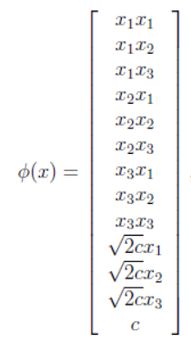

# 支持向量机（SVM)-4.核函数

## 一、核函数的引入

由于SVM是线性分类器，考虑数据在原始空间（或称输入空间）线性不可分的情况，我们将数据映射高维空间（称为特征空间）后很可能就线性可分了。

与此同时产生了一个新的问题：在高维空间上求解一个带约束的优化问题显然比在低维空间上计算量要大得多（所谓的“维数灾难”）

为了解决这个问题，我们引入核函数

## 二、实例

### 问题的引入

如图所示的两类数据分别分布为两个圆圈的形状，由于数据是线性不可分的，线性分类器无法处理

<figure><figcaption></figcaption></figure>

### Kernel方法处理非线性问题

考察上图所示的例子，我们可以看出理想的分界应当是一个闭合曲线而不是一条直线（二位平面的一个超平面）。若用 $x_1,x_2$ 表示这个二维平面的两个坐标，由于一条二次曲线的一般方程为：

 $$a_1 x_1+a_2 x_1^2+a_3 x_2+a_4 x_2^2+a_5 x_1 x_2 +a_6 =0$$

&#x20;如果我们构造另外一个五维的空间，其中五个坐标值分别为 $z_1 =x_1,z_2 =x_1^2,z_3=x_2,z_4=x_2^2,z_5=x_1 x_2$ ，那么，上面的方程显然可以写作： $\sum_{i=1}^{5}a_i z_i +a_6=0$

对于新的坐标 $Z$，这正是一个超平面的方程，也就是说，我们利用一个 $R^2 \rightarrow R^5$ 的映射，将原始数据映射到一个新的空间，在这个新空间里，数据变成了线性可分的！

## 三、核函数

### 核函数的定义

首先我们约定 $x_i^T x_j=$ < $x_i^T,x_j$ > ，我们将上面描述的映射用 $\phi$ 来表示，定义核函数（ $Kernel Fuction$ ）为： $K(x,z)=\phi(x)^T \phi(z)$

问题在于：计算 $K(x,z),\phi(x)$ 的时间复杂度都很高，幸运的是，我们可以发现：

 $$K(x,z)=(\sum_{i=1}^{n}x_i z_i)(\sum_{j=1}^{n}x_i z_i)$$\
&#x20;              $$=\sum_{i=1}^{n}\sum_{j=1}^{n}x_i x_j z_i z_j$$\
&#x20;              $$=\sum_{i,j=1}^{n}(x_i x_j)(z_i z_j)$$

所以我们只要计算出来原始数据 $x,z$ 各自的内积平方就等价于计算映射后特征向量的内积了。

### 一些映射函数的实例

#### 例1：

当原始数据为三维时，根据上面的公式，得到：\
.png>)\
核函数 $K(x,z)=(x^T z)^2$ 只能在这样的 $\phi$ 下才能成立

#### 例2：

对于核函数 $K(x,z)=(x^T+c)^2=\sum_{i,j=1}^{n}(x_i x_j)(z_i z_j)+\sum_{i=1}^{n}(\sqrt(2c)x_i)(\sqrt(2c)z_i)+c^2$\
对应的映射函数是：\

更一般地，核函数 $K(x,z)=(x^T z+c)^d$ 对应的映射后特征维度为 $C_{n+d}^n$

### Python sklearn库svm模块中支持的核函数

 $$Linear Kernel Function : \phi(x)= < x',x > $$

 $$RblKernelFunction:\phi(x)=exp(-\gamma\|x-x'\|^2)$$

 $$PolynomialKernelFunction:\phi(x)=(\gamma < x,x' > +r)^r$$

 $$SigmoidKernelFunction:tanh(\gamma<x,x'>+r)$$

## 四、问题的解决

仍然考虑下图所示的原始数据：

<figure><figcaption></figcaption></figure>

我们假设实际得到的超平面方程为： $a_1x_1^2+a_2(x_2-c)^2+a_3=0$ （即圆心在 $x_2$ 轴的一个园），我们只需要将他映射到 $z_1=x_1^2,z_2=x_2^2,z_3=x_2$ 这样一个三维空间中即可，下图是映射之后的结果，可以发现：数据是可以通过一个二维平面（三维空间的一个超平面）分开的！

<figure><figcaption></figcaption></figure>

原本我们得到的分类函数是：

$$f(x)=\sum_{i=1}^n \alpha_i y_i<x_i,x>+b$$

现在在映射后的空间，即：

$$f(x)=\sum_{i=1}^n \alpha_i y_i<\phi(x_i),\phi(x)>+b$$

而其中的 $\alpha$ 仍然是通过求解如下 $Lagrange$ $dual$ 问题得到的：

$$\underset{\alpha}{max}W(\alpha)=\sum_{i=1}^{m}\alpha_i - \frac{1}{2}\sum_{i,j=1}^{m}y_i y_j \alpha_i \alpha_j <\phi(x_i),\phi(x_j)>$$\
$$s.t.\alpha_i\geqslant0,i=1,...,m$$\
&#x20;      $$\sum_{i=1}^{m} \alpha_i y_i=0$$
